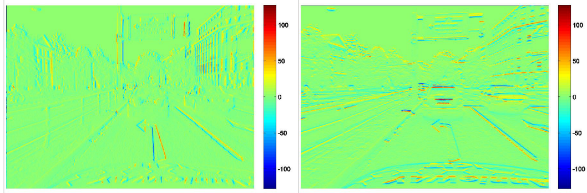

## Images

**gray-value images**

- regular pixel grid
- $g(u,v)$ indicates **brightness** at position $(u,v)$
- image given as 2-D, discretized, and quantized function
- origin of coordinate system: top-left corner, u- and v-axis

## Filtering

**image filtering with a filter mask**

卷积运算：可看作是加权求和的过程，使用到的图像区域中的每个像素分别和filter mask(权矩阵)的每个元素对应相乘，所有乘积之和作为区域中心像素的新值。

卷积运算对图像邻域的像素灰度进行平均，从而达到减小图像中噪声影响、降低图像对比度的目的。

**convolution operator(mathematical)**
$$
\begin{aligned}
(g * f)(u, v) &=\int_{\mathbb{R}^{2}} g(u-x, v-y) \cdot f(x, y) d(x, y) \\
& \approx \sum_{-\infty<i, j<\infty} g(u-i, v-j) \cdot f(i, j)
\end{aligned}​
$$

### Typical Filters

- **smoothing with Gaussian**

  高斯平滑与简单平滑不同，它在对邻域内像素进行平均时，给予不同位置的像素**不同的权值**，模板越靠近邻域中心位置，其权值越高。在图像细节进行模糊时，可以更多的保留图像总体的灰度分布特征。

  高斯滤波器最重要的参数就是高斯分布的标准差$\sigma$，标准差和高斯滤波器的平滑能力有很大的能力，$\sigma$越大，高斯滤波器的频带就较宽，对图像的平滑程度就越好。通过调节$\sigma$参数，可以平衡对图像的噪声的抑制和对图像的模糊。

  $f(u, v)=\frac{1}{2 \pi \sigma^{2}} e^{-\frac{1}{2} \frac{u^{2}+v^{2}}{\sigma^{2}}}$                                                             

  

  函数图像关于$(0,0)$ 对称，在原点有最大值，

- **partial derivatives(偏导数)**

  $\frac{\partial g}{\partial u} \approx \frac{g(u+1, v)-g(u-1, v)}{2}$， 这是一个估计值，线性组合，可转换为下图矩阵
  $\frac{\partial g}{\partial v} \approx \frac{g(u, v+1)-g(u, v-1)}{2}$

左边没有使用Sobel filter,水平方向产生zero response

右边没有使用Sobel filter,垂直方向产生zero response

- **2nd order derivative**

  - entries of the Hessian

    $\frac{\partial^{2} g}{(\partial u)^{2}}, \frac{\partial^{2} g}{\partial u \partial v}, \frac{\partial^{2} g}{(\partial v)^{2}}$$\frac{\partial^{2} g}{(\partial u)^{2}}, \frac{\partial^{2} g}{\partial u \partial v}, \frac{\partial^{2} g}{(\partial v)^{2}}$

  - Laplace operator

    $\frac{\partial^{2} g}{(\partial u)^{2}}+\frac{\partial^{2} g}{(\partial v)^{2}}$ 

  
  - filter combinations

    - Laplacian of Gausssian(LoG) = Laplace after Gauss

    

    homogeneous areas response zero, gray-level yield large value

## Edge Detection

**What is gray level edges?**

> In between those areas where very bright and dark areas touch each other, there is a line which we call the gray level edges(明暗相交处)

**Detection of gray level edges**

- idea 1: detecting maxima in gray-value gradients

  - filtering with Sobel filters
  - detection of local maxima in gray-scale gradients(局部最大值)
  - threshold filtering

  $\longrightarrow$ **Canny Operator**

  

- idea 2: zero-crossing in the 2nd order derivative

  - filtering with Sobel and Laplace filters
  - detection of points which cross the origin within the Laplace-filtered image. These must preferably exhibit large gradients

  $\longrightarrow$ **approach of Marr/Hildreth** 

  

##  Camera Optics

- **converting camera coordinates into image coordinates**

  

  - dimensions and resolution from light-sensitive chip(imager)
  - position of imager within the image plane
  - $$z \cdot\left(\begin{array}{c}
    u \\
    v \\
    1
    \end{array}\right)=\underbrace{\left(\begin{array}{ccc}
    \alpha^{\prime} & -\beta^{\prime} \cot \theta & u_{0} \\
    0 & \frac{\beta^{\prime}}{\sin \theta} & v_{0} \\
    0 & 0 & 1
    \end{array}\right)}_{=: A} \cdot\left(\begin{array}{l}
    x \\
    y \\
    z
    \end{array}\right)$$ 
  - intrinsic parameters:
    - horizontal and vertical resolution (often identical) $\alpha^{'},\beta^{'}$
    - coordinates of the principle point $u_0,v_0$
    - [ skewing angle $\theta $] → we assume it to be 90°

- **converting world (vehicle) coordinates to camera coordinates**

  

  - $\left(\begin{array}{l}
    x \\
    y \\
    z
    \end{array}\right)=R \cdot\left(\begin{array}{l}
    \xi \\
    \eta \\
    \zeta
    \end{array}\right)+\vec{t}=(R | \vec{t}) \cdot\left(\begin{array}{l}
    \xi \\
    \eta \\
    \zeta \\
    1
    \end{array}\right)$ 
  - extrinsic parameters:
    - translation $\vec{t}$
    - rotation$R$
    - rotation also in the form of roll, pitch, and yaw angle.

- **together: converting world (vehicle) coordinates to  image coordinates**

  - $z \cdot\left(\begin{array}{l}u \\ v \\ 1\end{array}\right)=A \cdot(R | \vec{t}) \cdot\left(\begin{array}{l}\xi \\ \eta \\ \zeta \\ 1\end{array}\right)$ 

  - intrinsic and extrinsic parameters can be determined with camera calibration.

    

  