用两个相机在不同的位置拍摄同一物体，如果两张照片中的景物有重叠的部分，我们有理由相信，这两张照片之间存在一定的对应关系，本节的任务就是如何描述它们之间的对应关系，描述工具是对极几何 ，它是研究立体视觉的重要数学方法。

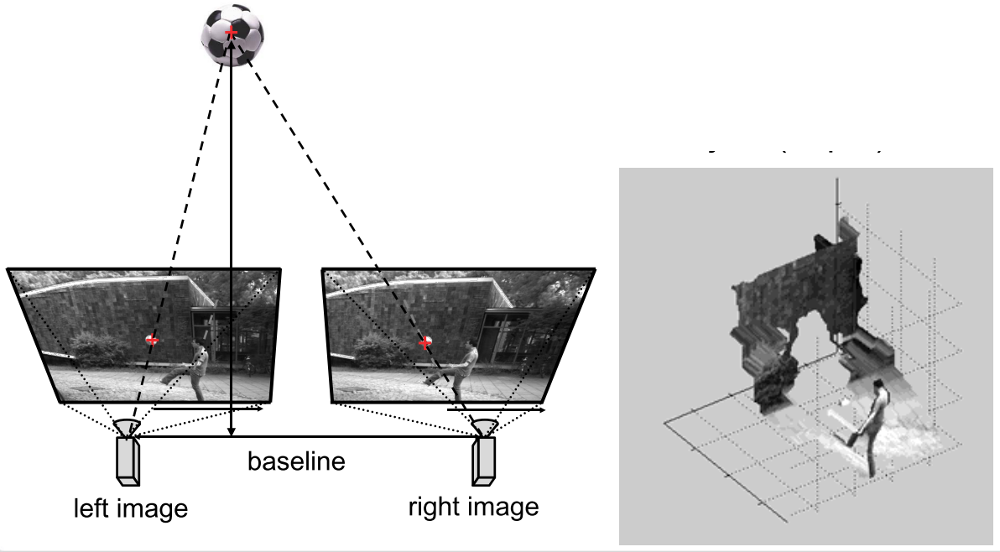

- scene is captured with two cameras
- $\mathbb{R^3}\to\R^2\times\R^2$
- 3d-reconstruction: determine distance  to object(depth)

## Epipolar Geometry (对极几何)

### Epipolar plane, lines, epipoles

**重要概念:**

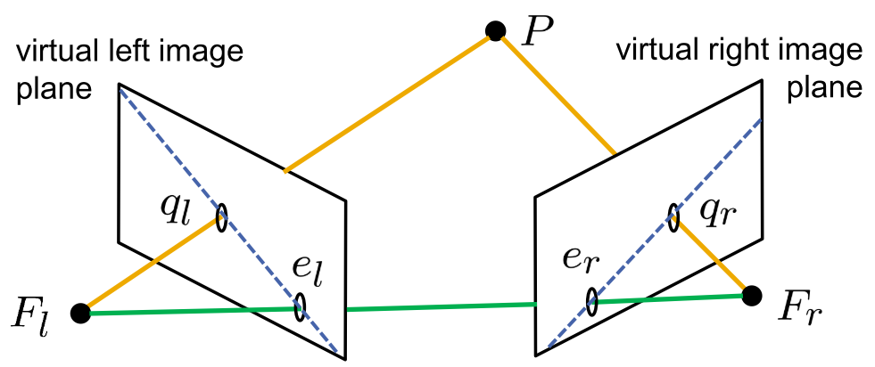

- $F_l,F_r$ 为两个相机的坐标原点

- $P,F_l,F_r$ form the epipolar(极平面)
- Epipoles(极点):
  - $e_l:$ left image of $F_r$ 右相机坐标原点在左像平面上的像
  - $e_r:$ right image of $F_l$ 左相机坐标原点在右像平面上的像
- $(q_l,e_l),(q_r,e_r):$ epipolar line

### Essential Matrix

**坐标表示:**

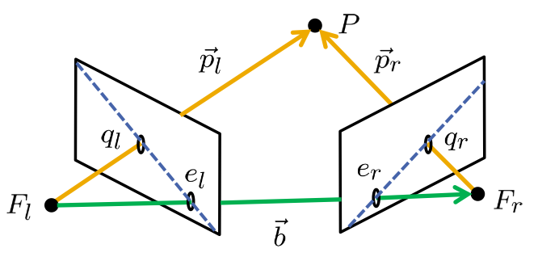

- left camera coordinate system:
  $$
  \vec{q_l}^L = \frac{1}{z_l^L}\vec{p_l}^L​\label{eq:1}
  $$
  

- right camera coordinate system:
  $$
  \vec{q}_{r}^{R}=\frac{1}{z_{r}^{R}} \vec{p}_{r}^{R}​\label{eq:2}
  $$
  

- given that vectors lie on a plane:

  $\left(\vec{p}_{r}^{L}\right)^{T} \cdot\left(\vec{b}^{L} \times \vec{p}_{l}^{L}\right)=0$ (三向量共面)须在同一坐标系下

**coordinate transformation(坐标转换):**

$\vec{x}^{L}=D \vec{x}^{R}+\vec{b}^{L}\quad \text{right camera coordinate} \to \text{leftcamera coordinate}$ 

$\begin{aligned} \vec{p}_{r}^{L}=\overrightarrow{F_{r} P}^L &=\overrightarrow{F_{l} P}^{L}-\overrightarrow{F_{l} F_{r}}^L \\ &=D \cdot \overrightarrow{F_{l} P}^{R}+\vec{b}^{L}-\left(D \cdot \overrightarrow{F_{l} F_{r}}^{R}+\vec{b}^{L}\right) \\ &=D \cdot\left(\overrightarrow{F_{l} P}^{R}-\overrightarrow{F_{l} F_{r}}^{R}\right) \\ &=D \cdot \overrightarrow{F_{r} P}^{R}=D \vec{p}_{r}^{R} \end{aligned}$ 
$$
\left(\vec{p}_{r}^{L}\right)^{T} \cdot\left(\vec{b}^{L} \times \vec{p}_{l}^{L}\right)=0 \quad \Rightarrow \quad\left(D \vec{p}_{r}^{R}\right)^{T} \cdot\left(\vec{b}^{L} \times \vec{p}_{l}^{L}\right)=0\label{eq:3}
$$
将$\eqref{eq:1},\eqref{eq:2}$ 带入上式$\eqref{eq:3}$:

$\begin{aligned} z_{r}^{R}\left(\vec{q}_{r}^{R}\right)^{T} D^{T}\left(\vec{b}^{L} \times z_{l}^{L} \vec{q}_{l}^{L}\right) &=0 \\\left(\vec{q}_{r}^{R}\right)^{T} D^{T}\left(\vec{b}^{L} \times \vec{q}_{l}^{L}\right) &=0 \end{aligned}$ 

叉乘写成矩阵形式：

$\vec{b}^{L} \times \vec{q}_{l}^{L}=\left(\begin{array}{ccc}0 & -b_{z}^{L} & b_{y}^{L} \\ b_{z}^{L} & 0 & -b_{x}^{L} \\ -b_y^{L} & b_x^{L} & 0\end{array}\right) \vec{q}_{l}^{L}=\left[\vec{b}^{L}\right] \cdot \vec{q}_{l}^{L}$ 

令 $E=D^T\left[\vec{b}^L\right]$:
$$
\left(\vec{q}_{r}^{R}\right)^{T} E \vec{q}_{l}^{L}=0
$$

- $E:$ essential matrix

- if $\vec{q}^L$ is known, the right epipolar line can be defined as follows:

  $\left(\vec{x}^{R}\right)^{T} E \vec{q}_{l}^{L}=0$ (已知左极线，可求得右极线)

- for the epipoles, the following quations apply:

  $\left(\vec{e}_{r}^{R}\right)^{T} E \vec{q}_{l}^{L}=0$ for all $\vec{q}_{l}^{L}$
  $\left(\vec{q}_{r}^{R}\right)^{T} E \vec{e}_{l}^{L}=0$ for all $\vec{q}_{r}^{R}$ 

**Why is epipole geometry import?**

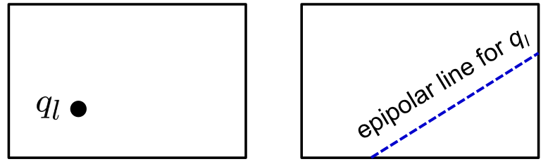

- $q_r$ must lie on the epipolar line $\to$ restrict search area (缩小搜索的范围）

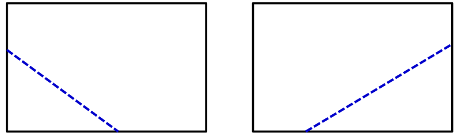

- one pair of epipolar lines describe the same plane
- **but**, when working with the essential matrix $E$ , **camera coordinates are used**,不方便，因此引入了 **Fundamental Matrix F**

### Fundamental Matrix

Image coordinates are preferred

- matrix with intrinsic(固有的) camera parameters $A_l,A_r$ 

  $F=A_{r}^{-T} E A_{l}^{-1}$ 

- in case of a pair of corresponding image coordinates:
  $$
  \left(u_{r}, v_{r}, 1\right) F\left(\begin{array}{c}
  u_{l} \\
  v_{l} \\
  1
  \end{array}\right)=0 \label{eq:5}
  $$

- shape of fundamental matrix can be calculated through a set of ≥8 corresponding image points (8 point algorithm) up to an unknown scaling factor

**Examples of epipolar geometry in image pairs:** 

- horizontal panning motion

  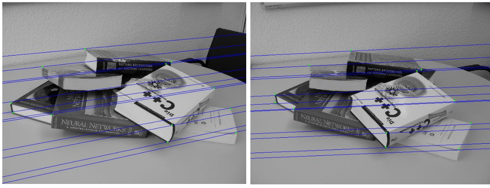

- vertical panning motion

  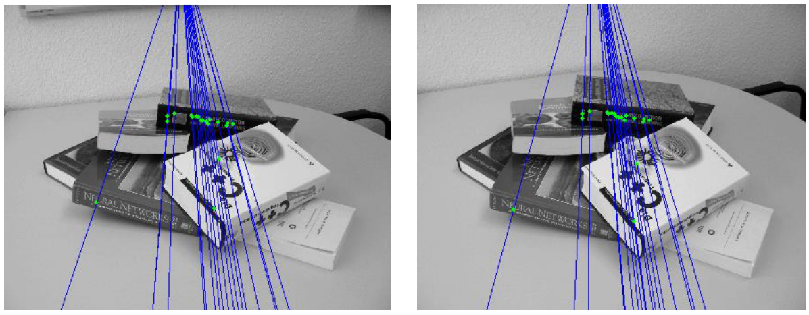

- horizontal and vertical panning motion

  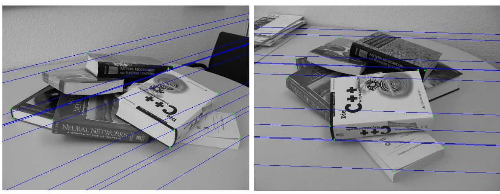

- motion parallel to optical axis

  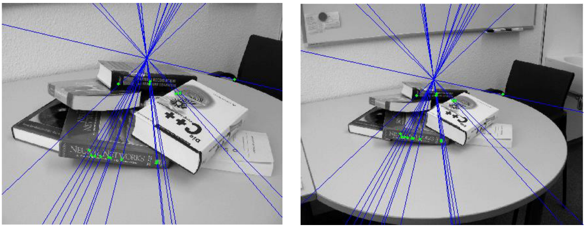

**Special cases: **

Identical image planes + intrinsic parameters

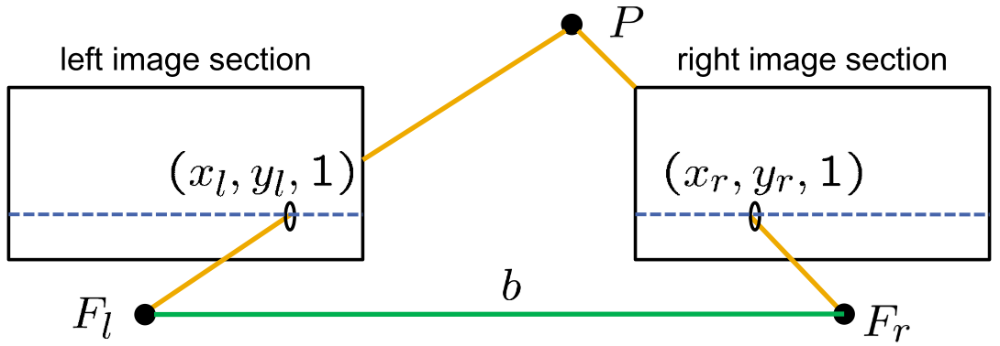

- epipolar lines are **parallel**

- epipoles are located at infinity

- particularly simple case, depth results directly from disparity:(深度决定差异)

  $P^{L}=\frac{b}{x_{l}^{L}-x_{r}^{R}}\left(\begin{array}{c}x_{l}^{L} \\ y_{l}^{L} \\ 1\end{array}\right)=\frac{b \alpha^{\prime}}{u_{l}-u_{r}}\left(\begin{array}{c}x_{l}^{L} \\ y_{l}^{L} \\ 1\end{array}\right)$ 

- disparity(in pixels): $d = u_l - u_r$

**Derivation**

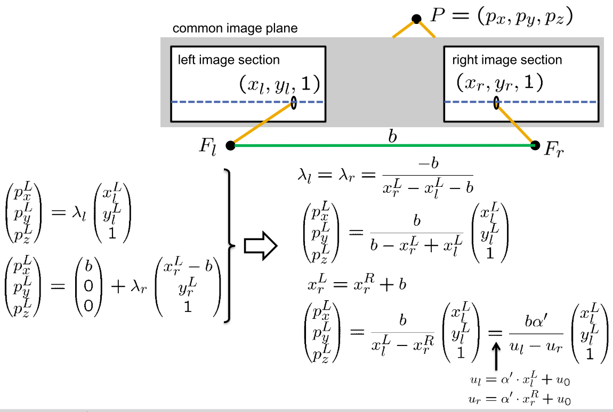

### Rectification

Rectification(修正):

> alignment of  image pairs with intersecting epipolar lines into images with parallel epipolar lines(修正原先相交的极线，变为平行)

 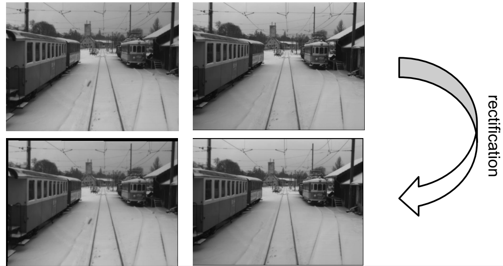

- starting point:

  two cameras with different camera parameters $A_l,A_r$ and different coordinate systems

- Objective:

  to define two "virtual" cameras

  - that possess the same focal length(相同焦距)
  - that are aligned(oriented) in the exact same way
  - whose x-axis is parallel to the baseline that connects the two focal points
  - whose focal points are identical to the original focal points

  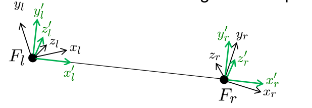

  修正步骤：

  1. find common camera parameters $A^{\prime},$ so that $A_{l} \approx A^{\prime} \approx A_{r}$

  2. find common camera coordinate systems, so that the x-axis lies parallel to the baseline

  3. find the rotation matrices $D_{l}, D_{r}$ in order to transform original coordinates into new coordinates

  4. transform original camera images into rectified images from the virtual cameras. 

    $p_{z} \cdot\left(\begin{array}{l}u \\ v \\ 1\end{array}\right)=A_{l} \cdot \vec{p}$
    $p_{z}^{\prime} \cdot\left(\begin{array}{l}u^{\prime} \\ v^{\prime} \\ 1\end{array}\right)=A^{\prime} \cdot \vec{p}^{\prime}=A^{\prime} \cdot D_{l} \cdot \vec{p}=A^{\prime} \cdot D_{l} \cdot A_{l}^{-1} \cdot p_{z} \cdot\left(\begin{array}{l}u \\ v \\ 1\end{array}\right)$
    $\frac{p_{z}^{\prime}}{p_{z}}\left(\begin{array}{l}u^{\prime} \\ v^{\prime} \\ 1\end{array}\right)=A^{\prime} D_{l} A_{l}^{-1} \cdot\left(\begin{array}{l}u \\ v \\ 1\end{array}\right)$ 

### Accuracy of Depth Estimates

Depth: $z(d)=\frac{b \alpha^{\prime}}{d}$ 

with Taylor approximation:
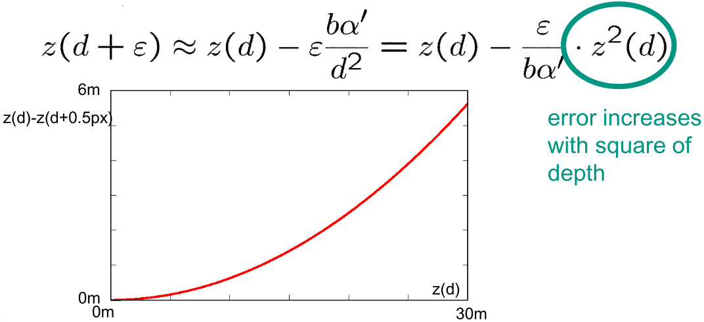

### Correspondence Problem

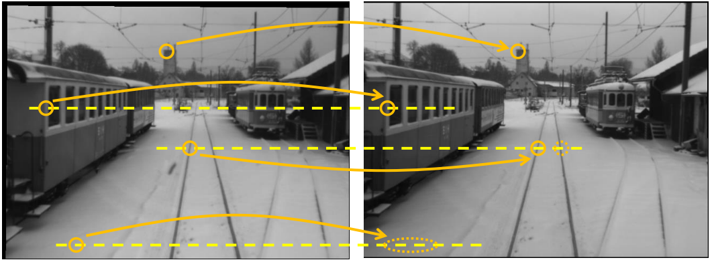

- possess the same gray-value
- possess the same local environment
- lie on the same pair of epipolar lines
- neighborhood is preserved(most of the time)
- u-coordinates in left image are larger than in right image(rectified images)

## Block matching

**Idea: ** compare local environment of two points

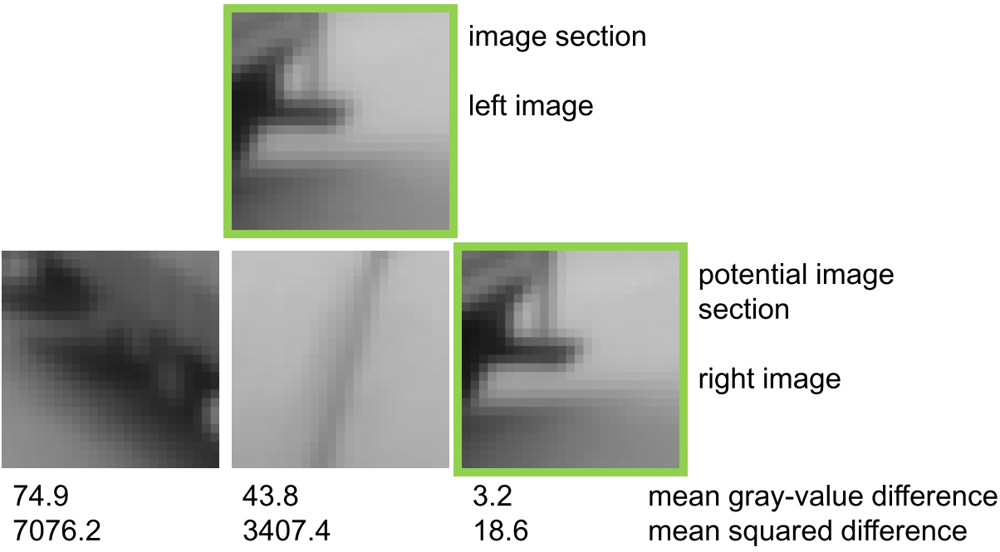

**mathematically expressed: **

- local environment around pixel $\left(u_{1}, v_{1}\right)$ in left image:
$g_{l}\left(u_{l}+i, v_{l}+j\right), \quad-n \leq i, j \leq n$

- difference between left and right segments 

  - sum over gray-value absolute difference:

  $$
  \sum_{i=-n}^{n} \sum_{j=-n}^{n}\left|g_{l}\left(u_{l}+i, v_{l}+j\right)-g_{r}\left(u_{r}+i, v_{r}+j\right)\right|
  $$

  - sum over gray-value squared error
    $$
    \sum_{i=-n}^{n} \sum_{j=-n}^{n}\left(g_{l}\left(u_{l}+i, v_{l}+j\right)-g_{r}\left(u_{r}+i, v_{r}+j\right)\right)^{2}
    $$

    correlation

    $$
    \frac{\frac{1}{(2 n+1)^{2}} \sum_{i=-n}^{n} \sum_{j=-n}^{n}\left(g_{l}\left(u_{l}+i, v_{l}+j\right)-\bar{g}_{l}\right) \cdot\left(g_{r}\left(u_{r}+i, v_{r}+j\right)-\bar{g}_{r}\right)}{\sqrt{V\left(g_{l}\right) V\left(g_{r}\right)}}
    $$

**Example: **

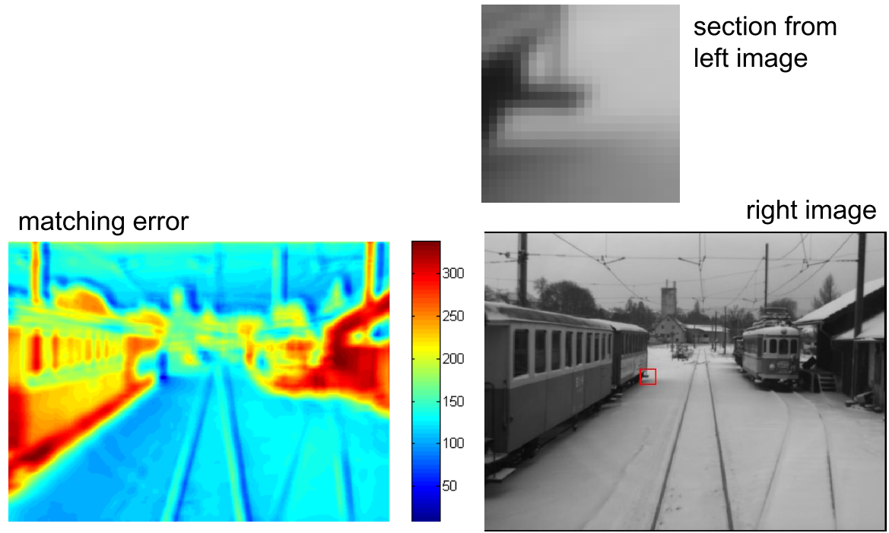

根据 left image 和 right image，计算 matching error, 找出值最小的点，即为匹配点

**Advantages:**

- very general method, always applicable
- epipolar geometry must not necessarily be known (可以搜索整个图)

**Disadvantages:**

- complete search is computationally very expensive
- a clear assignment is just possible when the gray-value structure in the local environment is rich
- larger environments increase computing time, while smaller environments suffer from poorer structure (指可能找不到匹配点)

**Note:**

> gray-values are not lighting independent. Thus, block matching works better on gradient images (e.g. Laplace or Sobel filtered images)

